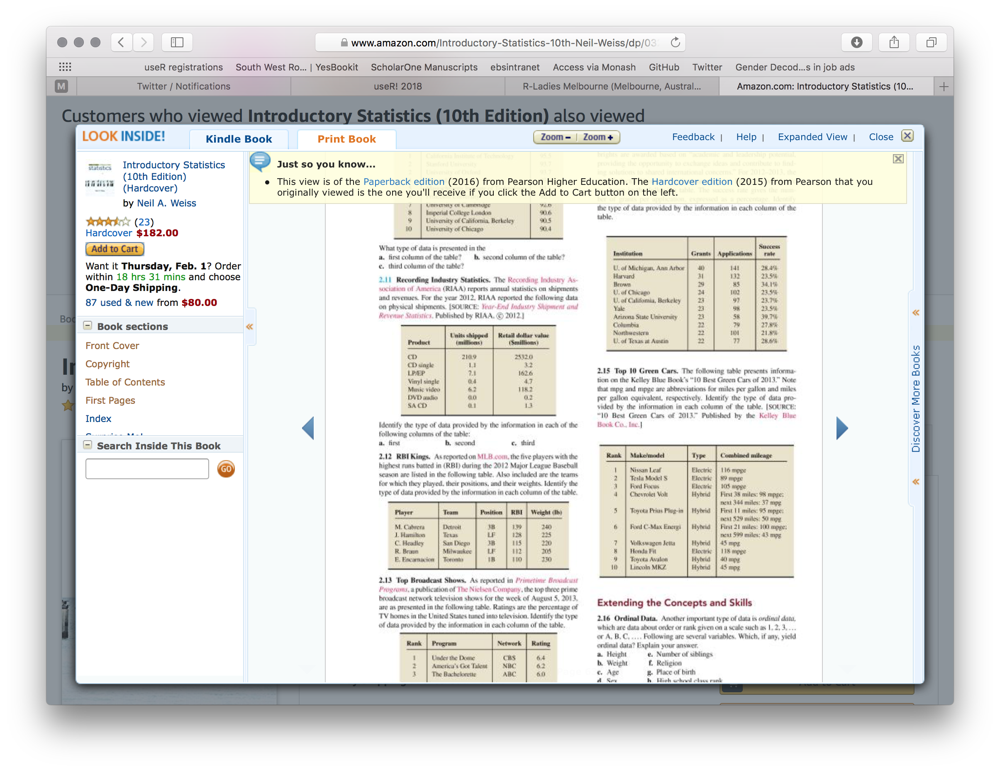
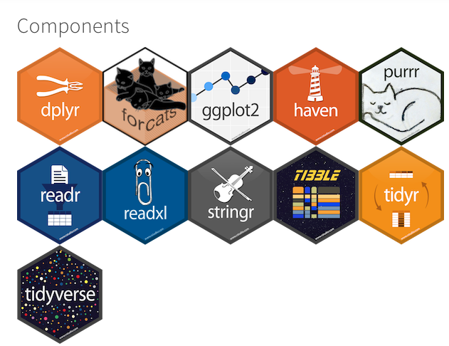

<style>
.footer {
    color: #434343;
    background: #ffffffff;
    position: fixed;
    top: 90%;
    text-align: left;
    width: 100%;
}
.header {
    color: black;
    background: #E8E8E8;
    position: fixed;
    bottom: 90%;
    text-align:center;
    width:100%;
}
.small-code pre code {
  font-size: 0.9em;
}
.column-left{
  float: left;
  width: 50%;
  text-align: left;
}
.column-right{
  float: right;
  width: 50%;
  text-align: right;
}
.center{
    left: 50%;
    text-align: center;
}
</style>

tidy
========================================================
author: 
date: 2018-02-16
autosize: true
font-family: 'Arial'
width: 1920
height: 1080


tidy
========================================================
* data structure
* workflow


Hadley
========================================================

<div align="center" style="margin-top:15%;">
  </img>
</div>


data structure: tidy data
========================================================

* each variable in a column
* each observation in a row
* each value in a cell


data structure: tidy jeopardy: iris
========================================================

```r
head(iris)
```

```
  Sepal.Length Sepal.Width Petal.Length Petal.Width Species
1          5.1         3.5          1.4         0.2  setosa
2          4.9         3.0          1.4         0.2  setosa
3          4.7         3.2          1.3         0.2  setosa
4          4.6         3.1          1.5         0.2  setosa
5          5.0         3.6          1.4         0.2  setosa
6          5.4         3.9          1.7         0.4  setosa
```


data structure: tidy jeopardy: mtcars
========================================================

```r
head(mtcars)
```

```
                   mpg cyl disp  hp drat    wt  qsec vs am gear carb
Mazda RX4         21.0   6  160 110 3.90 2.620 16.46  0  1    4    4
Mazda RX4 Wag     21.0   6  160 110 3.90 2.875 17.02  0  1    4    4
Datsun 710        22.8   4  108  93 3.85 2.320 18.61  1  1    4    1
Hornet 4 Drive    21.4   6  258 110 3.08 3.215 19.44  1  0    3    1
Hornet Sportabout 18.7   8  360 175 3.15 3.440 17.02  0  0    3    2
Valiant           18.1   6  225 105 2.76 3.460 20.22  1  0    3    1
```


data structure: tb data
========================================================


<small>

```r
tb <- read_csv('~/localRepos/meet_R/practice_data/tb.csv')
head(tb)
```

```
# A tibble: 6 x 22
  iso2   year  m_04 m_514 m_014 m_1524 m_2534 m_3544 m_4554 m_5564  m_65
  <chr> <int> <int> <int> <int>  <int>  <int>  <int>  <int>  <int> <int>
1 AD     1989    NA    NA    NA     NA     NA     NA     NA     NA    NA
2 AD     1990    NA    NA    NA     NA     NA     NA     NA     NA    NA
3 AD     1991    NA    NA    NA     NA     NA     NA     NA     NA    NA
4 AD     1992    NA    NA    NA     NA     NA     NA     NA     NA    NA
5 AD     1993    NA    NA    NA     NA     NA     NA     NA     NA    NA
6 AD     1994    NA    NA    NA     NA     NA     NA     NA     NA    NA
# ... with 11 more variables: m_u <int>, f_04 <int>, f_514 <int>,
#   f_014 <int>, f_1524 <int>, f_2534 <int>, f_3544 <int>, f_4554 <int>,
#   f_5564 <int>, f_65 <int>, f_u <int>
```
</small>


open any textbook
========================================================
title: false

Open an intro to ANY statistics textbook...

<div class="footer" style="font-size:60%;">
  <hr>
  <p>"To the Tidyverse and Beyond: Challenges for the Future in Data Science", D. Cook, bit.ly/rstudio-cook</p>
</div>


stats book preview
========================================================
title: false

<div align="center" style="margin-top:0%;">
  </img>
</div>

<div class="footer" style="font-size:60%;">
  <hr>
  <p>"To the Tidyverse and Beyond: Challenges for the Future in Data Science", D. Cook, bit.ly/rstudio-cook</p>
</div>


statistics starts once you have tidy data
========================================================
title: false

<p align="center" style="bold">...and you will find that statistics <font style="color:#686868; font-style:italic">(analysis, plotting - anything, really)</font> starts once you have tidy data</p>


<div class="footer" style="font-size:60%;">
  <hr>
  <p>"To the Tidyverse and Beyond: Challenges for the Future in Data Science", D. Cook, bit.ly/rstudio-cook</p>
</div>


workflow
========================================================

<div align="center" style="margin-top:10%;">
  </img>
</div>


<div class="footer" style="font-size:60%;">
  <hr>
  <p>"Grolemund, G. and H. Wickham. R for Data Science"</p>
</div>


workflow
========================================================

<div align="center" style="margin-top:10%;">
  </img>
</div>

<br>
<br>

"all data are crap, it is just a matter of how much work you have to do to make them useful" Good 'ol Ben

<div class="footer" style="font-size:60%;">
  <hr>
  <p>"Grolemund, G. and H. Wickham. R for Data Science"</p>
</div>


tidyverse
========================================================

<div align="center" style="margin-top:0%;">
  </img>
</div>
