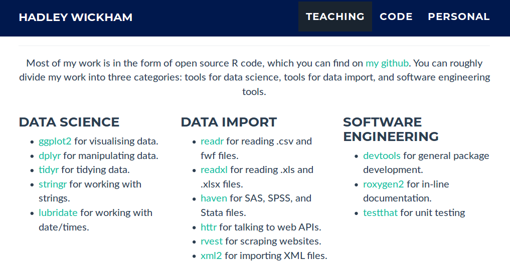
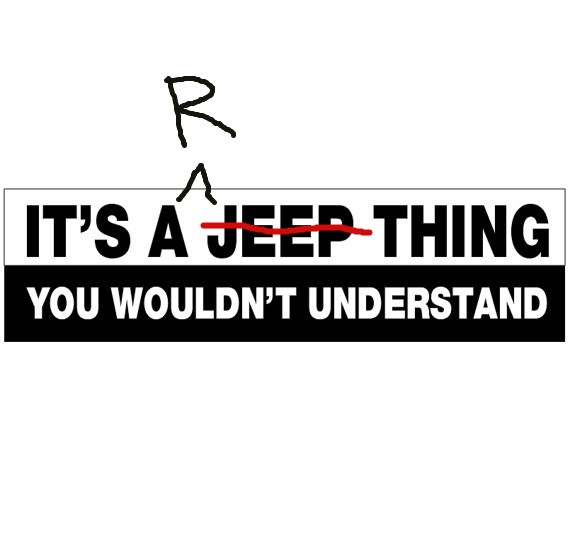
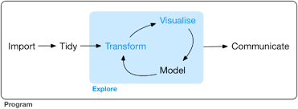

tidy
========================================================
author: 
date: 2018-02-16
autosize: true
font-family: 'Arial'
width: 1920
height: 1080

tidy
========================================================
* data structure
* workflow
* tool suite

Hadley
========================================================
title: false

  </img>

  </img>

R thing
========================================================
title: false

  </img>

data structure: tidy data
========================================================

* each variable in a column
* each observation in a row
* each value in a cell

Tidy Jeopardy
========================================================
title: false

  </img>

open any textbook
========================================================
title: false

Open an intro to ANY statistics textbook...

  

  
"To the Tidyverse and Beyond: Challenges for the Future in Data Science", D. Cook, bit.ly/rstudio-cook

stats book preview
========================================================
title: false

  </img>

  

  
"To the Tidyverse and Beyond: Challenges for the Future in Data Science", D. Cook, bit.ly/rstudio-cook

statistics starts once you have tidy data
========================================================
title: false

...and you will find that statistics (analysis, plotting - anything, really) starts once you have tidy data

  

  
"To the Tidyverse and Beyond: Challenges for the Future in Data Science", D. Cook, bit.ly/rstudio-cook

workflow
========================================================

  </img>

<small>
It is often said that 80% of data analysis is spent on the process of cleaning and preparing
the data
 
Dasu and Johnson 2003

 

All data are crap, it is just a matter of how much work you have to do to make them useful.
 
good ol' Ben
</small>

  

  
Grolemund, G. and H. Wickham. 2001. R for Data Science; Wickham, H. 2014. Tidy Data

write for humans
========================================================

Programs must be written for people to read, and only incidentally for machines to execute. 
 
Hal Abelson

 

  <pre style="color:black; font-style:bold; font-size:32px;">
  
  new_thing <- thing %>%
    do something to thing %>%
    do something to thing %>%
    do something to thing
  </pre>

  

  
Tidyverse, Hadley Wickham, https://speakerdeck.com/hadley/tidyverse

tidyverse
========================================================

  </img>

